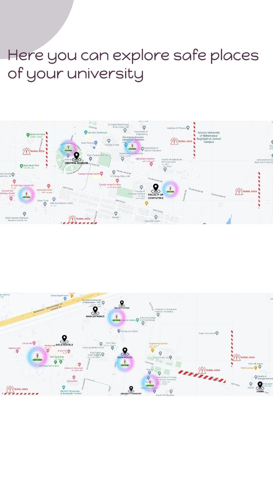

# safeCampus
campus Safety application for android
Features
1 Easy to understand
2 Shake detector
3 safety tips
4 Call to registered security guard mobile numbers
5 Shake device to send emergency text to registered mobile and play siren
6 Sends Last Known Location to registered mobile.
7 Now we can add multiple contacts to send emergency text
8 University safe zone areas map.

Prerequisites :
Android Studio Basic knowledge about Realtime database.
Build and Run Application
Safe women at campus A Women Safety Application requires Android Oreo or newer version to run.

Follow this steps to get Working Project!
Clone this repository or download file
Extract zip if downloaded code
Open project in Android Studio
Wait while Android Studio Download gradle or required files
Hit Run Button !

<h1> Main screen </h1> 

<h1> Menu screen </h1> 

<h1> Emergency Call screen </h1> 

<h1> Safety tips screen </h1> 

<h1> Maps screen </h1> 

