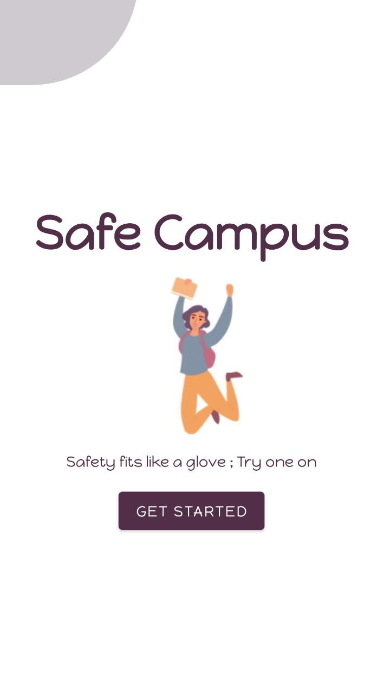
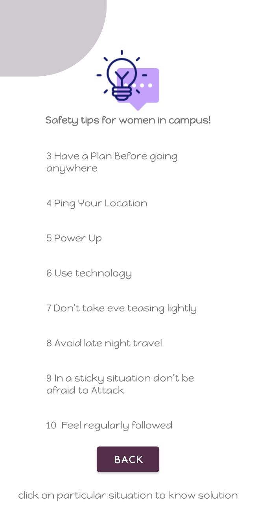

# safeCampus
campus Safety application for android
<h1> Features </h1> 
1 Easy to understand 
2 Shake detector 
3 safety tips 
4 Call to registered security guard mobile numbers 
5 Shake device to send emergency text to registered mobile and play siren 
6 Sends Last Known Location to registered mobile. 
7 Now we can add multiple contacts to send emergency text 
8 University safe zone areas map.  
<h1> Prerequisites :</h1> 

Android Studio Basic knowledge about Realtime database. 
Build and Run Application 
Safe women at campus A Women Safety Application requires Android Oreo or newer version to run.    Follow this steps to get Working Project!</h1> 
Clone this repository or download file 
Extract zip if downloaded code 
Open project in Android Studio 
Wait while Android Studio Download gradle or required files 
Hit Run Button ! 

<h1> Main screen </h1> 

<h1> Menu screen </h1> 

<h1> Emergency Call screen </h1> 

<h1> Safety tips screen </h1> 

<h1> Maps screen </h1> 

